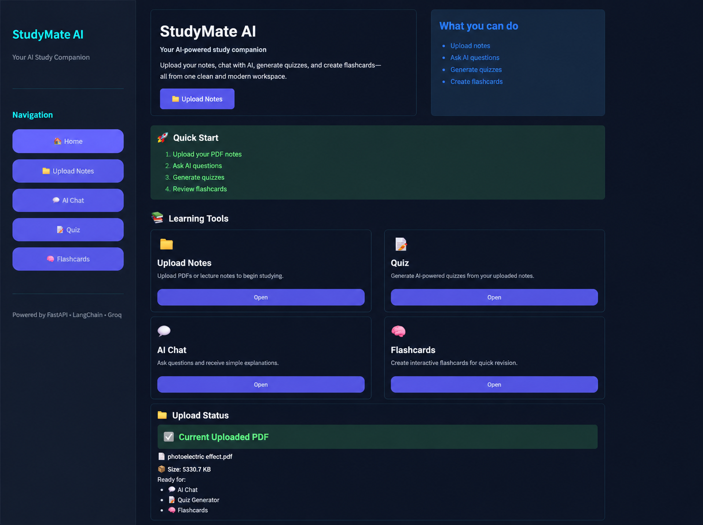
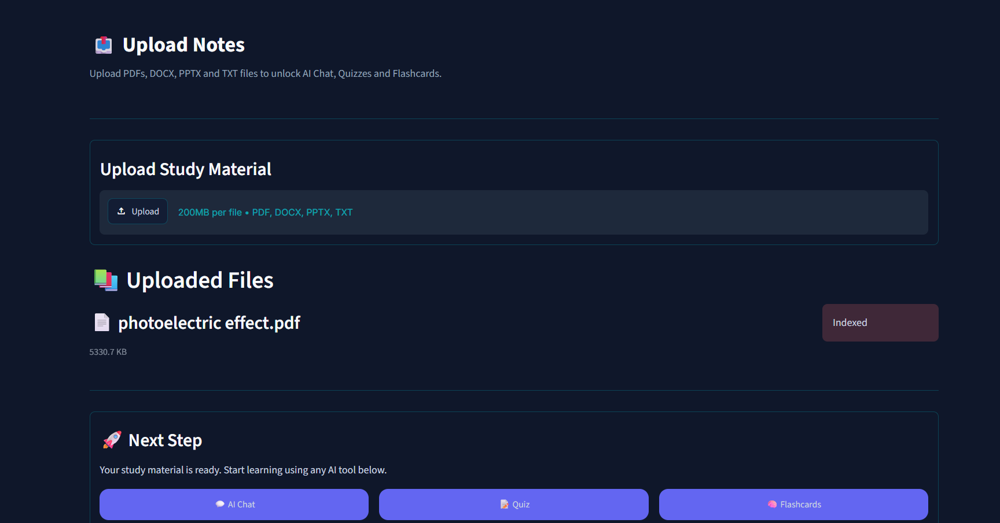
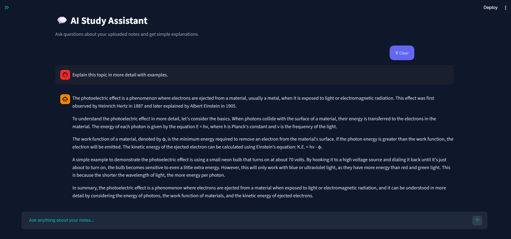
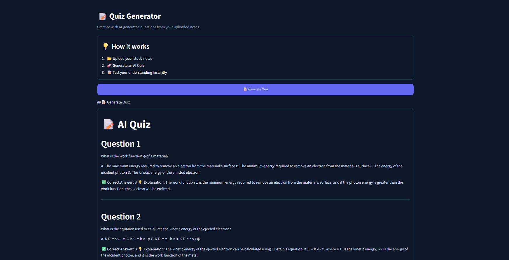
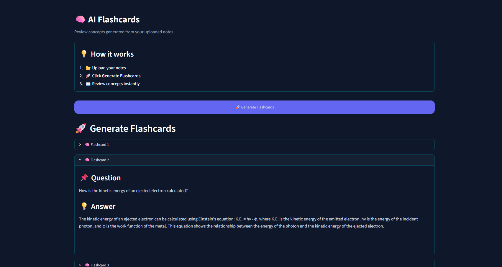
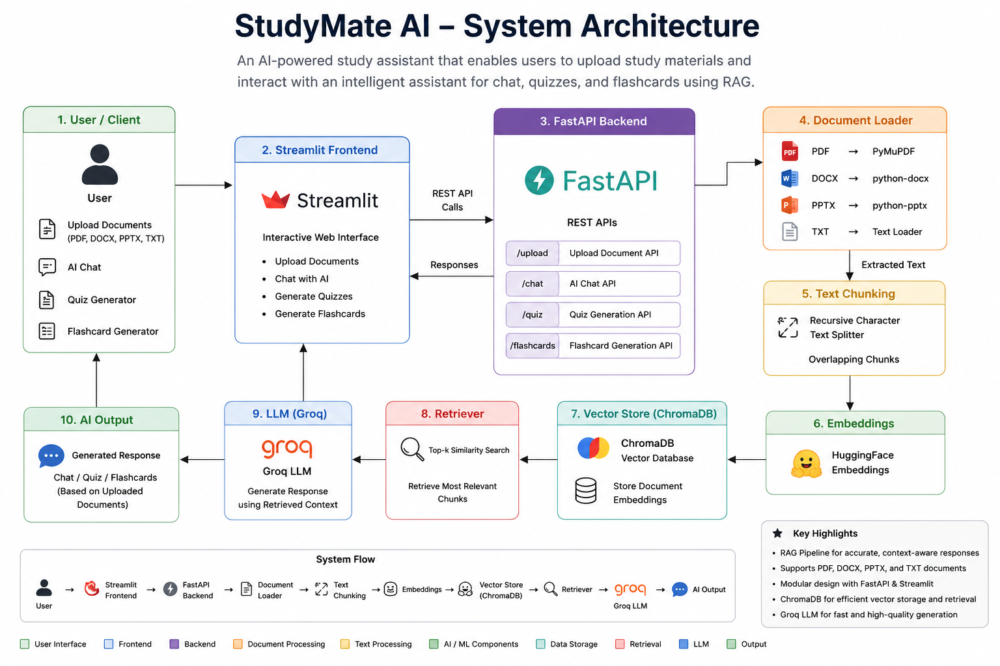

# StudyMate AI

StudyMate AI is an AI-powered study assistant that helps students learn from their own study material. Users can upload notes in different formats, ask questions, generate quizzes, and create flashcards. The application uses Retrieval-Augmented Generation (RAG) to provide responses based only on the uploaded documents instead of relying on general knowledge.

This project was developed as part of our **Generative & Agentic AI Summer Internship Program (SIP 2026)** capstone.

---

## Project Overview

Many students rely on notes from lectures, PDFs, and presentations while preparing for exams. Finding information from these resources can be time-consuming. StudyMate AI helps by allowing users to upload their study material and interact with it through an AI assistant. The application uses Retrieval-Augmented Generation (RAG) so that responses are based on the uploaded documents, making them more relevant and reducing incorrect answers.

---

## Features

- Upload PDF, DOCX, PPTX, and TXT files
- AI chat based on uploaded study material
- Quiz generation from uploaded notes
- Flashcard generation for quick revision
- Retrieval-Augmented Generation (RAG)
- Semantic search using ChromaDB
- Automatic document processing and indexing
- Session reset when a new document is uploaded
- Clean and simple Streamlit interface

---

## Tech Stack

### Backend
- Python
- FastAPI
- LangChain
- ChromaDB
- HuggingFace Embeddings
- Groq API

### Frontend
- Streamlit

### AI Concepts Used
- Retrieval-Augmented Generation (RAG)
- Vector Database
- Semantic Search
- Prompt Engineering

---

## Project Structure

```text
StudyMate-AI
│
├── backend
│   ├── routers
│   ├── services
│   ├── uploads
│   ├── chroma_db
│   ├── utils
│   ├── main.py
│   ├── requirements.txt
│   └── .env
│
├── frontend_new
│   ├── components
│   ├── views
│   ├── app.py
│   └── ...
│
├── README.md
└── .gitignore
```

---

## How It Works

1. The user uploads a study document.
2. The document is processed and split into smaller chunks.
3. The chunks are converted into embeddings and stored in ChromaDB.
4. When the user asks a question, the most relevant chunks are retrieved.
5. Groq generates a response using the retrieved context.
6. The same knowledge base is also used to generate quizzes and flashcards.

---

## Running the Project

### Clone the repository

```bash
git clone https://github.com/Nikita-Gupta280/StudyMate-AI.git
```

### Backend

```bash
cd backend

python -m venv .venv
```

Activate the virtual environment.

Windows

```powershell
.venv\Scripts\activate
```

Install dependencies.

```bash
pip install -r requirements.txt
```

Create a `.env` file and add your Groq API key.

```env
GROQ_API_KEY=your_api_key
```

Run the backend.

```bash
uvicorn main:app --reload
```

### Frontend

```bash
cd frontend_new

streamlit run app.py
```

---

## Current Status

- ✅ Multi-format document upload
- ✅ AI Chat
- ✅ Quiz Generation
- ✅ Flashcard Generation
- ✅ RAG Pipeline
- ✅ FastAPI Backend
- ✅ Streamlit Frontend

---

## Future Work

- Support multiple uploaded documents
- User authentication
- Save chat history
- Study planner
- Cloud deployment
- Performance improvements

---

# Screenshots

## Home



---

## Upload Notes



---

## AI Chat



---

## Quiz Generator



---

## Flashcards



---

# Project Architecture
## System Architecture



---

## Team

| Member | Contribution |
|----------|--------------|
| **Nikita Gupta** | Backend Development, API Integration |
| **Bhawana** | RAG Pipeline and Document Processing |
| **Khushi** | AI Features and Testing |
| **Avni** | Frontend Development |

---

## Acknowledgements

This project was built using FastAPI, Streamlit, LangChain, ChromaDB, HuggingFace Embeddings, and the Groq API.
